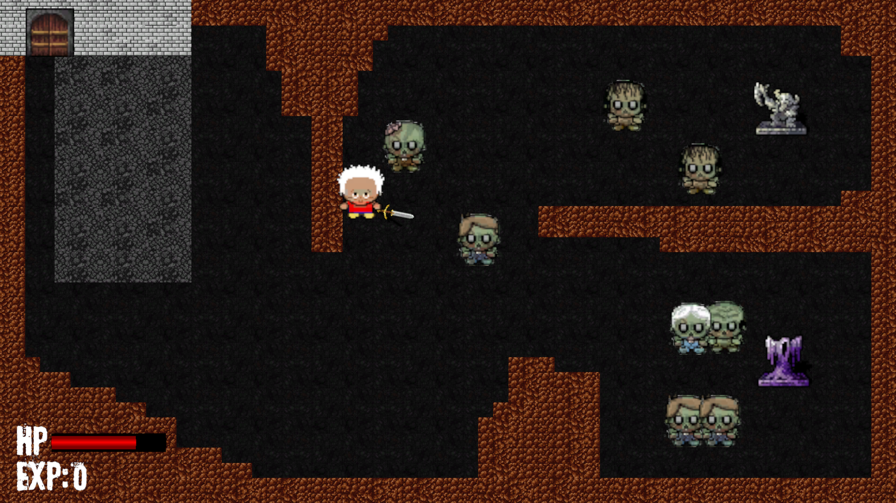
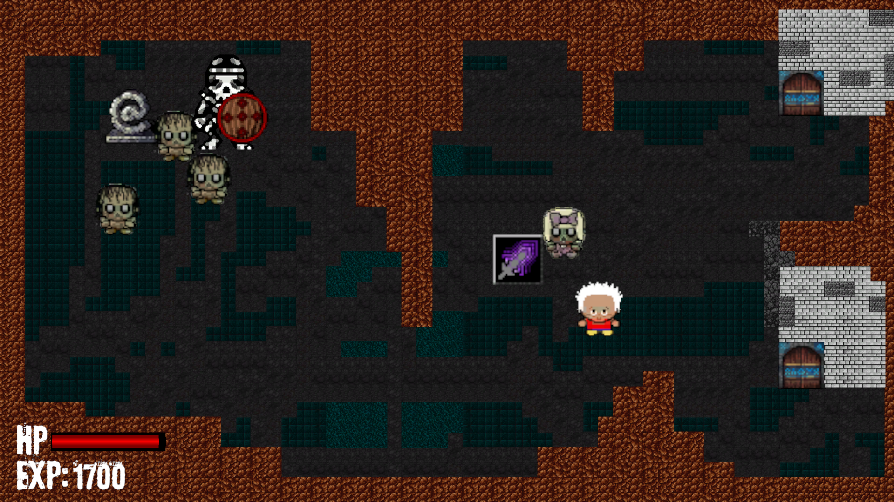
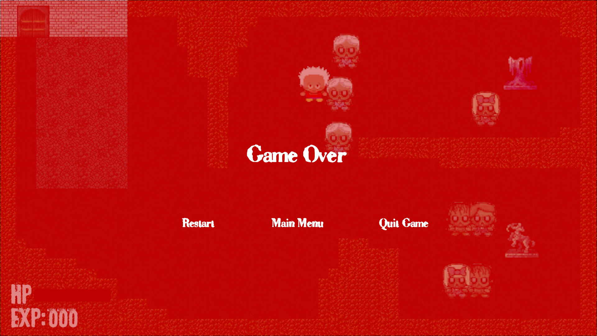

# ZOMBRAWL

## Overview
ZOMBRAWL is a top-down action roguelike where players battle through zombie-infested levels. Featuring fast-paced combat, weapon upgrades, and boss battles, players must clear each level of undead to progress through gateways to the next challenge.

## Screenshots

## Features
- Top-down action combat with weapon upgrades
- Multiple levels with increasing difficulty
- Boss battles that gate progression
- Health regeneration mechanic when defeating enemies
- Dynamic audio system with environment-specific music
- Full dialogue system for story elements

## Controls
- WASD: Move character
- Mouse: Aim weapon
- Left Mouse Button: Attack
- E/Space: Interact/Continue dialogue

## Development
ZOMBRAWL was developed using Unity 6.1 as a game design document (GDD) project.

## Team Members
- San Lin Htet (6540187)
- Sai Naing Yi Tun (6540191)

